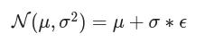
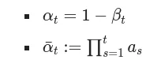
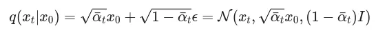
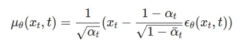
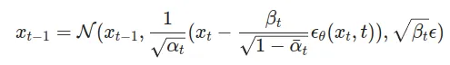

# DDPM Denoising Diffusion Probabilistic Model Implementation

## Forward Process
𝝱 in the range [0.0001, 0.02] and set the total timesteps T = 1000

X0 is the original picture

ϵ is adding noise to the picture in the from of N(0,1)

## Reverse Process
ϵθ​(x_t​,t) is model’s output. Network is trying to denoise and predict the image from the existing noise.

σ = √𝝱

## Training Loss MSE "ELBO"
